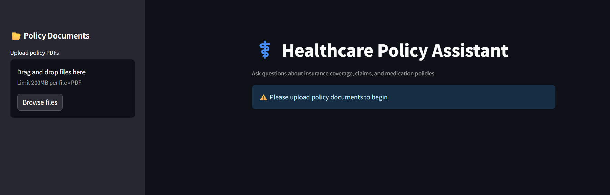
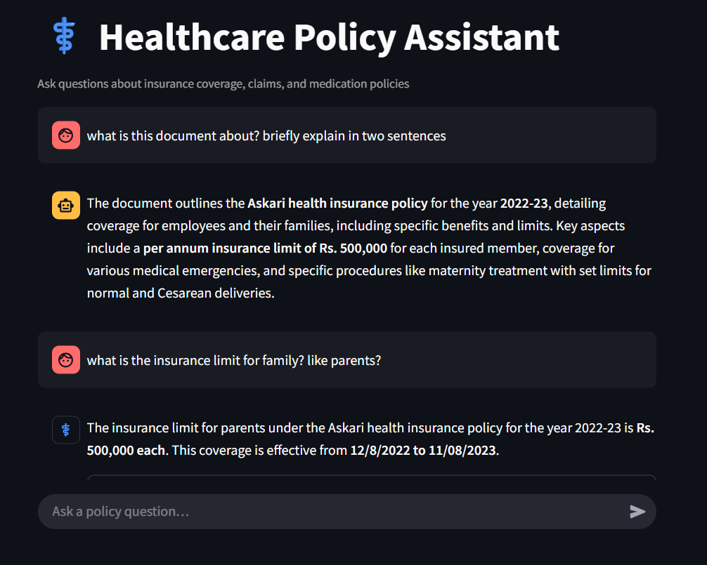

# Healthcare Policy Assistant RAG



A production-grade Retrieval-Augmented Generation (RAG) application for healthcare policy Q&A, built with Streamlit, LangChain, OpenAI, and FAISS. Upload policy documents, ask questions, and get answers with source transparency.

---

## Features
- **Document Upload & Indexing:** Upload PDF policy documents, which are split, embedded, and indexed for fast retrieval.
- **Conversational Q&A:** Ask questions about insurance coverage, claims, and medication policies.
- **Source Transparency:** See which document and page each answer is based on.
- **Production-Ready:** Modular, testable, and containerized for deployment.
- **Secure:** API keys and secrets managed via `.env` and Pydantic settings.

---

## Project Structure
```
healthcare policy assistant RAG/
├── app/
│   ├── config.py
│   ├── logging_config.py
│   ├── data_ingestion/
│   ├── embeddings/
│   ├── rag/
│   ├── ui/
│   └── utils/
├── policy_documents/
├── vector_store/
├── tests/
├── requirements.txt
├── Dockerfile`
├── .env
└── README.md
```

---

## Getting Started

### 1. Clone the Repository
```bash
git clone <repo-url>
cd "healthcare policy assistant RAG"
```

### 2. Install Dependencies
```bash
pip install -r requirements.txt
```

### 3. Set Up Environment Variables
Create a `.env` file in the project root:
```
OPENAI_API_KEY=sk-...
```

### 4. Run the App
```bash
streamlit run app/ui/main.py
```

---

## Usage
1. **Upload PDFs:** Use the sidebar to upload healthcare policy documents (PDF).
2. **Process Documents:** Click "Process Documents" to index them.
3. **Ask Questions:** Use the chat interface to ask questions about the policies.
4. **View Sources:** Expand the "View source excerpts" to see which document and page the answer came from.

---

## Testing
Run all tests with:
```bash
pytest
```

---

## Docker
Build and run the app in a container:
```bash
docker build -t healthcare-policy-assistant .
docker run -p 8501:8501 --env-file .env healthcare-policy-assistant
```

---

## License
This project is licensed under the MIT License.

---

## Screenshot

